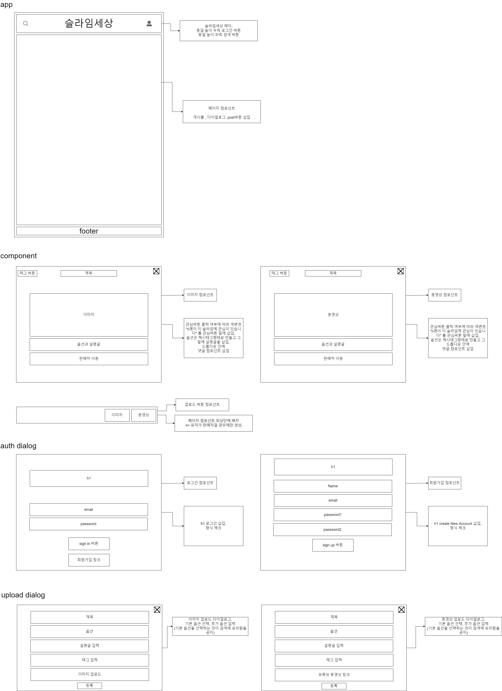

# slimeWorld-application

# 개요

슬라임 장난감은 ASMR과 비슷한 청각 자극과 함께 촉각을 자극하여 많은 여성들의 인기를 끌고 있다. 그에 따라 저렴한 슬라임, 질 좋은 슬라임 등 다양한 종류의 슬라임이 나오고 있으며 부속 부품인 비즈, 엑티베이터 등도 함께 판매되고 있다. 구매자들은 **인스타 검색**이나 **유튜브 검색**을 통해 슬라임의 판매 정보를 얻을 수 있다.

하지만 **위 검색 시스템을 통해서는 슬라임에 대한 정보들이 규격화 되어있지 않아**서 찾아보기 불편한 점이 있다.

그래서 판매자들이 슬라임의 특징을 옵션으로 추가하고 사진, 영상과 함께 판매처를 업로드 할 수 있으며, 구매자는 태그가 달린 게시글을 확인하면서 판매처로 이동할 수 있는 웹애플리케이션인 **슬라임세상**을 기획하게 되었다.

> 💡 **판매자** : 옵션, 이미지파일(또는 영상링크), 판매처 업로드
>
> **구매자** : 게시글 태그 확인, 판매처 이동

 

# 서비스 구조

### 🔎 로그인해서 게시물 가져오기

 

### 🔎 이미지 게시물 업로드

 

### 🔎 동영상 게시물 업로드

 

### 🔎 게시물 완전 삭제

 

 

# 설계

### 🔎 DataBase

 

### 🔎 Backend

[/auth/\* API](./spec/api/authAPI.md)

[/slime/\* API](./spec/api/slimeAPI.md)

 

### 🔎 Frontend

